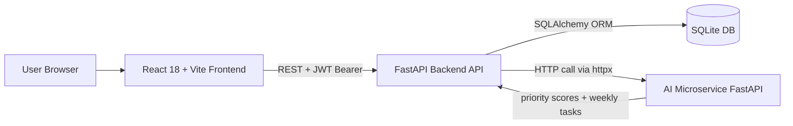

# Intelligent Study Planner - Architecture

## Architecture Diagram

## Layer / Component Description

- **Frontend (React + Vite)**  
  Handles UI routes (`/login`, `/register`, `/dashboard`), user interactions, form state, and API requests through a centralized client (`api.js`).

- **Backend (FastAPI + SQLAlchemy)**  
  Exposes core APIs for authentication, topics, planner tasks, doubts, insights, and AI usage logs.  
  Handles JWT validation and role checks (`student`, `mentor`, `admin`) before protected operations.

- **AI Microservice (FastAPI)**  
  Runs as a separate process (default `:8001`) and provides:
  - `POST /generate-plan`
  - `POST /priority-score`  
  It encapsulates planning/scoring logic so the main backend remains focused on business APIs and persistence.

- **Database (SQLite)**  
  Stores users, topics, study tasks, doubts, and AI usage logs.  
  SQLAlchemy models manage relationships and CRUD persistence.

## Data Flow for Key Actions

### 1) Login

1. User submits email/password in frontend.
2. Frontend calls `POST /auth/login` on backend.
3. Backend validates credentials, returns JWT token + user profile.
4. Frontend stores token in runtime state and includes it in `Authorization: Bearer <token>` for protected APIs.

### 2) Generate Plan

1. User clicks "Generate AI Weekly Plan" in dashboard.
2. Frontend calls `POST /planner/generate?student_id={id}`.
3. Backend loads student topics + unresolved doubt counts from SQLite.
4. Backend calls AI microservice `POST /generate-plan` with topic metadata.
5. AI service returns planned weekly tasks with priority scores.
6. Backend replaces existing planner tasks for that student and persists new tasks.
7. Frontend refreshes tasks/insights from backend.

### 3) Raise Doubt

1. User submits doubt form from dashboard.
2. Frontend calls `POST /doubts?student_id={id}` with title/description/topic reference.
3. Backend validates ownership and stores doubt in SQLite.
4. Frontend reloads doubts list; mentors/admins can later update status via `PATCH /doubts/{id}`.
